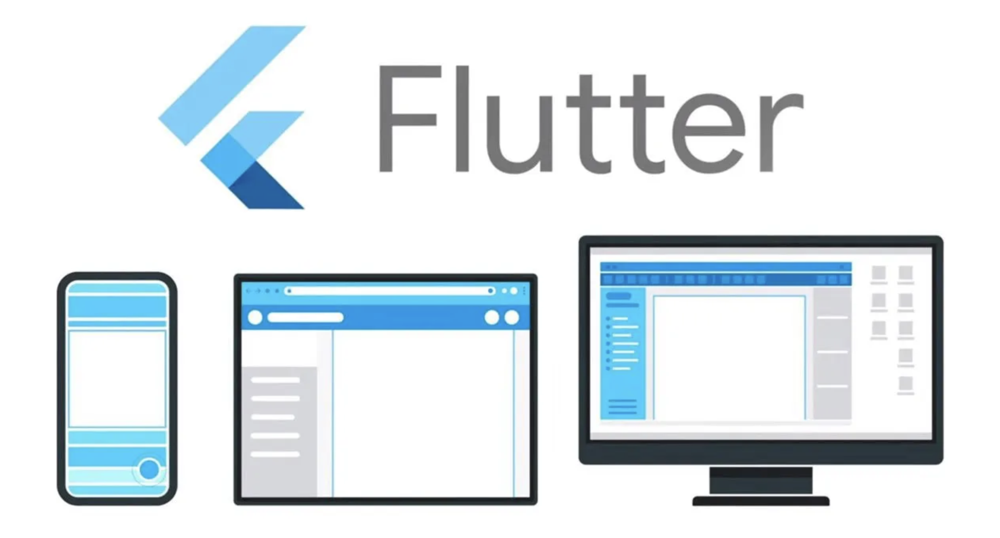

# Final Flutter Project 📱📲 

## Welcome, Holbies!

Welcome to the final Flutter Project. This journey is designed to be special, challenging, yet immensely rewarding. As we embark on developing a mobile application, we're stepping into a complex arena that requires dedication, creativity, and a keen understanding of the tools at our disposal.

### Why Flutter?

Developing a mobile application that supports both Android and iOS traditionally requires coding in two distinct languages using separate frameworks. This is where Flutter makes a significant difference. It's a high-performance framework based on the Dart language, enabling the development of cross-platform applications with ease. By rendering the UI directly on the operating system's canvas, Flutter ensures optimal performance and a smooth user experience across both platforms.

### Motivation

We understand the challenges that come with such a sophisticated project, especially with limited Flutter knowledge. But remember, we are Holberton students, and there's nothing we can't achieve when we put our minds to it. We believe in you and your ability to conquer this challenge. To get started and lighten up your mood, click on this [LINK](#).

### Let's Begin the Journey

#### Resources

To aid in your project, here are some valuable resources:

- [Dart - Cheatsheet](https://dart.dev/codelabs/dart-cheatsheet)
- [FlutterFire Overview](https://firebase.flutter.dev/docs/overview/)
- [Getting started with Firebase on Flutter](https://www.youtube.com/watch?v=EXp0gq9kGxI&t=780s&ab_channel=Firebase)
- [Get Started with Firebase Authentication on Flutter](https://firebase.flutter.dev/docs/auth/start/)
- [Cloud Storage on Flutter](https://firebase.google.com/docs/storage/flutter/start?hl=es-419)
- [Layouts in Flutter](https://docs.flutter.dev/ui/layout)
- [Introduction to widgets](https://docs.flutter.dev/ui)
- [Firebase Storage Load and Display Images | Flutter](https://www.youtube.com/watch?v=AQQJJw3zOqs)

#### Example Code

Here's a simple example to get you started with Flutter and Firebase:

```dart
import 'package:flutter/material.dart';
import 'package:firebase_core/firebase_core.dart';

void main() async {
  WidgetsFlutterBinding.ensureInitialized();
  await Firebase.initializeApp();
  runApp(MyApp());
}

class MyApp extends StatelessWidget {
  @override
  Widget build(BuildContext context) {
    return MaterialApp(
      home: Scaffold(
        appBar: AppBar(
          title: Text('Welcome to Flutter'),
        ),
        body: Center(
          child: Text('Hello, Holbies!'),
        ),
      ),
    );
  }
}
```


### Firebase Integration

[Firebase](https://firebase.google.com/) is a comprehensive platform provided by Google that offers various backend services for mobile and web applications. It provides features such as real-time database, authentication, cloud storage, hosting, and more, making it easier to develop and scale your applications.

#### Key Features of Firebase:

- **Realtime Database**: Firebase offers a NoSQL cloud database that allows developers to store and sync data between users in real-time.
  
- **Authentication**: With Firebase Authentication, you can easily integrate secure authentication methods such as email/password, Google Sign-In, Facebook Login, etc., into your app.
  
- **Cloud Firestore**: Firestore is a flexible, scalable database for mobile, web, and server development. It allows for more complex queries and scales better than the real-time database for larger applications.
  
- **Cloud Storage**: Firebase provides cloud storage for user-generated content like images and videos, making it easy to store, access, and share files securely.
  
- **Hosting**: Firebase Hosting allows you to deploy web apps and static content with a fast, secure, and reliable hosting solution backed by Google's global network.
  
- **Cloud Functions**: Extend your app's functionality by writing custom backend code that automatically responds to events triggered by Firebase features and HTTPS requests.
  
- **Analytics**: Firebase Analytics provides insight into user behavior, allowing you to understand how users interact with your app and make data-driven decisions to improve user engagement and retention.
  
- **Performance Monitoring**: Monitor your app's performance and identify issues affecting the user experience with Firebase Performance Monitoring.
  
- **Remote Config**: Dynamically adjust your app's behavior and appearance without publishing app updates using Firebase Remote Config.
  
- **Cloud Messaging**: Send targeted messages and notifications to users across platforms with Firebase Cloud Messaging (FCM).
  
- **AdMob**: Monetize your app by integrating AdMob, Google's mobile advertising platform, to display ads to users.

#### Getting Started with Firebase:

To integrate Firebase into your Flutter app, you'll need to follow these steps:

1. **Create a Firebase project**: Go to the [Firebase Console](https://console.firebase.google.com/) and create a new project.

2. **Add your app to the Firebase project**: Register your app with Firebase and follow the setup instructions to download the `google-services.json` file for Android or `GoogleService-Info.plist` file for iOS.

3. **Add Firebase SDK dependencies**: Add the Firebase SDK dependencies to your Flutter app by following the instructions provided in the Firebase Console.

4. **Initialize Firebase in your app**: Initialize Firebase in your app by adding the necessary configuration code in your `main.dart` file.

5. **Start using Firebase services**: Once Firebase is set up, you can start using its various services in your app, such as authentication, database, cloud storage, etc.

For detailed instructions on how to integrate Firebase with your Flutter app, refer to the [Firebase documentation](https://firebase.flutter.dev/docs/overview).

Happy coding with Flutter! 🎉

## :sunglasses: Author
Manuel Zambrano

- [my Github](https://github.com/mnlazs)
